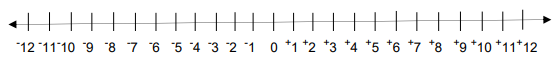
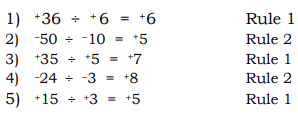
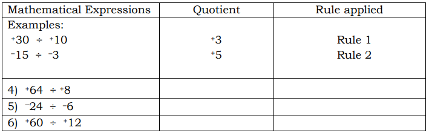
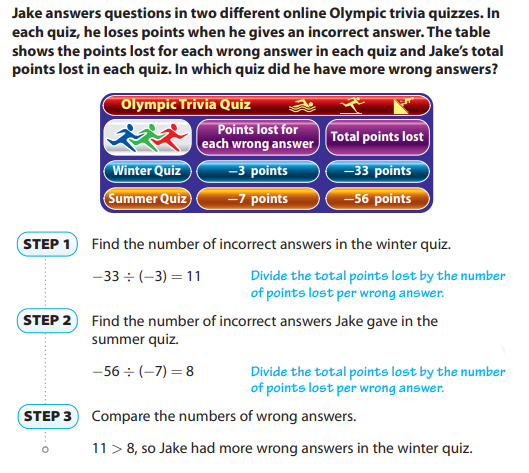

## What I need to know?

This module was designed and written with you in mind. It is here to help you master Dividing Integers. The scope of this module permits it to be used in many different learning situations. The language used recognizes your diverse vocabulary as student. The lessons are arranged to follow the standard sequence of the course. But the order in which you read them can be changed to correspond with the textbook you are now using.

The module is divided into two lessons, namely: • Lesson 1 – Dividing Integers with Like Signs • Lesson 2 – Dividing Integers with Unlike Signs

## What I know

A. Use the number line to solve for the quotient of the following integers. Write your answers on your answer sheet.

1\) +10 ÷ +5 = 2) +9 ÷ +3 =

B. Use your positive and negative counters to divide the following integers. Write your answers with correct sign on your answer sheet.

3\) +16 ÷ +2 = 4) –18 ÷ –3 = 5) –80 ÷ –4 =

C. Below are division equations involving integers. Find the value of N by dividing each item. Write your answers on your answer sheet. 6) +36 ÷ +6 = N 7) +72 ÷ +8 = N 8) –6 ÷ –3 = N 9) –39 ÷ –13 = N 10) +45 ÷ +15 = N

### *RECAP*

Answer the following questions briefly.

1\. What is the difference of one negative number and one positive number?

2\. What is the difference of 14 and -3?

3\. How far is 10 from 25 on the number line?

## LESSON 1: Dividing Integers with Like Signs

Division is the inverse of multiplication. It is the process of finding the quotient of two numbers, the dividend which is the number to be divided and the divisor, the number that divides. Dividing integers follow the same steps in dividing whole numbers. But, in dividing integers, you must be careful of the sign to be used in your final answer. In this lesson, you will learn how to divide integers with like signs.

# What’s In

Use the given illustrations below to solve for the quotient of the following numbers. Write your answers on your answer sheet.

**1) 10 ÷ 5 =**

2\) 12 ÷ 3 =

3\) 8 ÷ 2 =

4\) 16 ÷ 4 =

 5) 24 ÷ 3 =

#### **RULES IN DIVIDING INTEGERS**

Note : 

## What’s New

Read and study the problem below.

## What is It

To determine the number of kilometers JR traveled per hour, we are going to divide 18 by 3.

Eighteen kilometers going north is represented by the integer positive eighteen (+18). Three hours is represented by the integer positive three (+3).

So our equation will be **+18 ÷ +3 = N**

Now, let us visualize +18 ÷ +3 = N using counters. To perform the division operation of integers using counters, follow the suggested steps below:

**Step 1:** Get the exact number of counters to represent your dividend. Get the 18 positive counters. Place them on your table.

**Step 2:** Draw boxes to represent the number of sets to where the counters will be distributed evenly. Draw 3 boxes.

The quotient is the number of equal counters in each set.

How many counters did you distribute to all the sets? (18)

In to how many sets did you distribute the counters evenly? (3)

How many counters do you have in each set?

6 positive counters

Do these counters in each set have the same sign? (Yes) What is the sign? (Positive) Therefore, if you divide +18 by +3 you will get the quotient of +6.

**+18 ÷ +3 = N**

Going back to the problem, JR traveled 6 kilometers per hour going north (+6). We can also visualize how to divide +18 by +3 using a number line.

**Step 1:** From 0, locate +18 on the number line by moving 18 units to the right of 0.

**Step 2:** Divide the total number of units (18) which is the dividend into 3 equal parts since our divisor is +3.

Each part represents the distance traveled in one hour and the number of units in each part represents the number of kilometers JR traveled every hour. See (the) illustration below.

On the first hour, JR traveled a distance of 6 kilometers, another 6 kilometers during the second hour and then 6 kilometers during the third hour. Hence, he traveled a distance of 6 kilometers every hour.

Therefore **+18 ÷ +3 = N**

Dividing integers is just like dividing whole numbers. In dividing integers with like signs, the following rules are applied.

**Rule 1.** The quotient of two positive integers is a **positive integer**

( + ) ÷ ( + ) = ( + ) **Example:** ( +18 ) ÷ ( +3 ) = ( +6 )

**Rule 2.** The quotient of two negative integers is a positive integer. ( –) ÷ ( –) = ( + ) **Example:** ( –10 ) ÷ ( –2) = ( +5 )

**Point to Remember** In short, the quotient of two integers having the same signs is a **positive integer.**

Study more examples below.

## What’s More

A. Using your positive and negative counters, divide the given integers. Write your answers with correct sign on your answer sheet. 1) +24 ÷ +6 = 2) –8 ÷ –4 = 3) +15 ÷ +3 =

B. Complete the table by solving for the quotient of the given mathematical expressions. Write the quotient on the 2nd column and the rule applied on the third column. Write your answers on your answer sheet

## What I Have Learned

In dividing integers with like signs, ➢ the quotient of two positive integers is a positive integer ( + ) ÷ ( + ) = ( + ); and, ➢ the quotient of two negative integers is a positive integer ( – ) ÷ ( – ) = ( + ). Point to Remember ➢ The quotient of two integers having the same signs is a positive integer.

## What I Can Do

A. Find the value of N by dividing the following integers using counters or number line. Write your answers on your answer sheet. 1) –35 ÷ –7 = N 2) +28 ÷ +2 = N 3) –18 ÷ –3 = N

B. Give the quotient of the following by applying the rules in dividing integers with like signs. Write your answers on your answer sheet. 4) +45 ÷ +15 = N 5) –150 ÷ –15 = N

C. Solve the problem below. Show your solution on your answer sheet and label your final answer.

Hans received ₱300 for helping his aunt in her sari-sari store for 6 hours. If his aunt pays him in an hourly basis, how much did he earn in an hour?

## Lesson 2 : Dividing Integers with Unlike Signs

You used the relationship between multiplication and division to make conjectures about the signs of quotients of integers. You can use multiplication to understand why division by is not possible.

Think about the division problem below and its related multiplication problem.

5 ÷ 0 = ? 0 × ? = 5

The multiplication sentence says that there is some number times 0 that equals 5. You already know that 0 times any number equals 0. This means division by 0 is not possible, so we say that division by 0 is undefined.

#### EXAMPLE 1

The concept in dividing whole numbers is applied in this lesson. In dividing integers with unlike signs, simply divide the given numbers and remember that the product is always negative.

## Using Integer Division to

Solve Problems

You can use integer division to solve real-world problems. For some problems, you may need to perform more than one step. Be sure to check that the sign of the quotient makes sense for the situation.

To solve for the quotient of two integers, we need to follow the rule in dividing integers with unlike signs.

**Rule:** In dividing integers with unlike signs, divide as whole numbers and consider the signs of the dividend and the divisor. Thus, the quotient of a negative and a positive integer is always negative integer. **In symbol:** ( +) ÷ ( –) = ( –) or ( –) ÷ ( +) = ( –)

Study more examples below. 1) What is the quotient of –50 ÷ +5 ? Solution: –50 ÷ +5 ? = –10 2) Divide +24 by –4 Solution: +24 ÷ –4 = –6

## What’s More

A. Use your counters to solve for the quotient. Write your answers on your answer sheet. 1) –18 ÷ +9 = 2) +10 ÷ –2 =

B. Give the quotient of the following integers applying the rule in dividing integers with unlike signs. Write your answers on your answer sheet. 3) –15 ÷ +3 = 4) +14 ÷ –2 = 5) –9 ÷ +9 =

## What I Have Learned

In dividing positive and negative integers, the quotient is always a negative integer. In symbol: ( + ) ÷ ( –) = ( –) or ( –) ÷ ( +) = ( –)

## What I Can Do

A. Divide the following integers. Write your answers on your answer sheet. 1) –40 ÷ +8 = 2) +28 ÷ –2 = 3) –18 ÷ +2 = 4) –45 ÷ +15 = 5) –100 ÷ +5 =
