### *RECAP*

Answer the following questions briefly.

1\. What is the difference of one negative number and one positive number?

2\. What is the difference of 14 and -3?

3\. How far is 10 from 25 on the number line?

## LESSON 1: Dividing Integers with Like Signs

Division is the inverse of multiplication. It is the process of finding the quotient of two numbers, the dividend which is the number to be divided and the divisor, the number that divides. Dividing integers follow the same steps in dividing whole numbers. But, in dividing integers, you must be careful of the sign to be used in your final answer. In this lesson, you will learn how to divide integers with like signs.

# What’s In

Use the given illustrations below to solve for the quotient of the following numbers. Write your answers on your answer sheet.

**1) 10 ÷ 5 =**

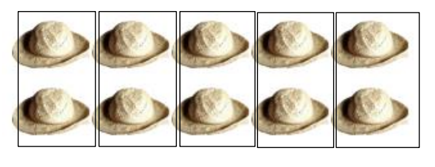

2\) 12 ÷ 3 =

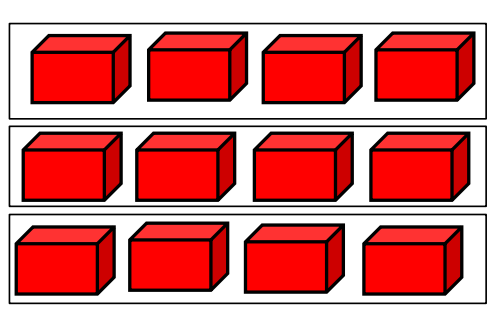

3\) 8 ÷ 2 =

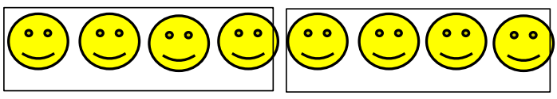

4\) 16 ÷ 4 =

 5) 24 ÷ 3 =

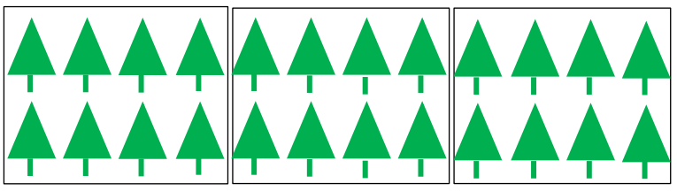

#### **RULES IN DIVIDING INTEGERS**

Note : 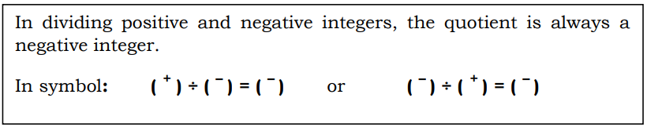

## What’s New

Read and study the problem below.

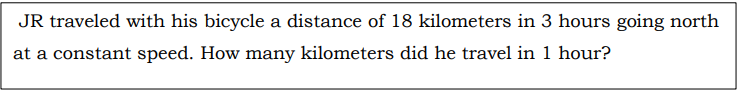

## What is It

To determine the number of kilometers JR traveled per hour, we are going to divide 18 by 3.

Eighteen kilometers going north is represented by the integer positive eighteen (+18). Three hours is represented by the integer positive three (+3).

So our equation will be **+18 ÷ +3 = N**

Now, let us visualize +18 ÷ +3 = N using counters. To perform the division operation of integers using counters, follow the suggested steps below:

**Step 1:** Get the exact number of counters to represent your dividend. Get the 18 positive counters. Place them on your table.

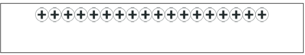

**Step 2:** Draw boxes to represent the number of sets to where the counters will be distributed evenly. Draw 3 boxes.

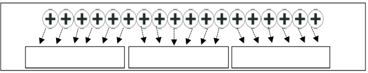

The quotient is the number of equal counters in each set.

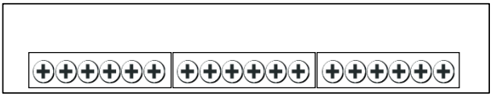

How many counters did you distribute to all the sets? (18)

In to how many sets did you distribute the counters evenly? (3)

How many counters do you have in each set?

6 positive counters

Do these counters in each set have the same sign? (Yes) What is the sign? (Positive) Therefore, if you divide +18 by +3 you will get the quotient of +6.

**+18 ÷ +3 = N**

Going back to the problem, JR traveled 6 kilometers per hour going north (+6). We can also visualize how to divide +18 by +3 using a number line.

**Step 1:** From 0, locate +18 on the number line by moving 18 units to the right of 0.

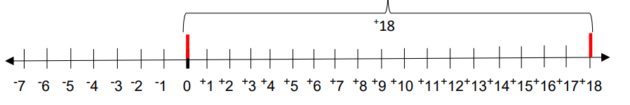

**Step 2:** Divide the total number of units (18) which is the dividend into 3 equal parts since our divisor is +3.

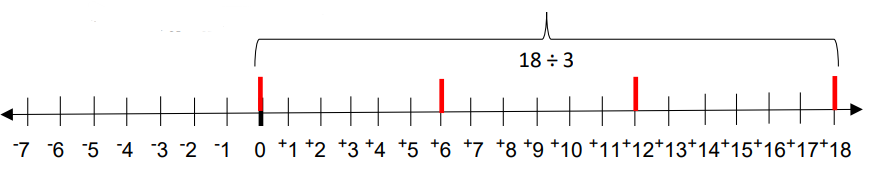

Each part represents the distance traveled in one hour and the number of units in each part represents the number of kilometers JR traveled every hour. See (the) illustration below.

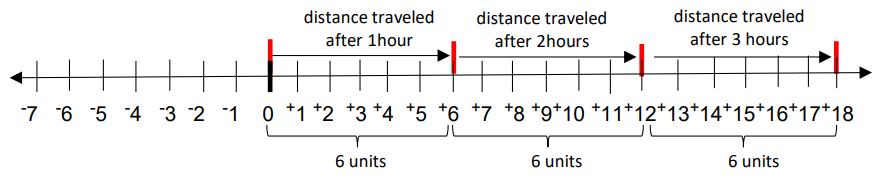

On the first hour, JR traveled a distance of 6 kilometers, another 6 kilometers during the second hour and then 6 kilometers during the third hour. Hence, he traveled a distance of 6 kilometers every hour.

Therefore **+18 ÷ +3 = N**

## Lesson 2 : Dividing Integers with Unlike Signs

You used the relationship between multiplication and division to make conjectures about the signs of quotients of integers. You can use multiplication to understand why division by is not possible.

Think about the division problem below and its related multiplication problem.

5 ÷ 0 = ? 0 × ? = 5

The multiplication sentence says that there is some number times 0 that equals 5. You already know that 0 times any number equals 0. This means division by 0 is not possible, so we say that division by 0 is undefined.

#### EXAMPLE 1

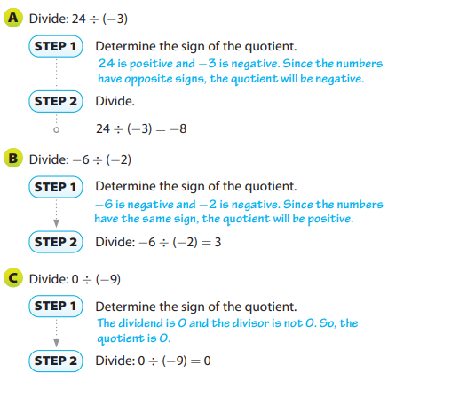

The concept in dividing whole numbers is applied in this lesson. In dividing integers with unlike signs, simply divide the given numbers and remember that the product is always negative.
